# MDD AI Workflow — End to End Process Flow

> Two repos, two teams, one continuous workflow. This diagram traces an ML model from project start to completed MDD, showing exactly where Claude Code skills are invoked, where the handoff between `mrm-mdd-kit` and `mrm-mdd-template-generator` happens, and how MRM governs the process without slowing down model development.

---

## Color Key

| Color | Meaning |
|---|---|
| Dark navy | Start / end |
| Dark blue | Decision points |
| Purple | `mrm-mdd-template-generator` — MRM governance flow |
| Teal | Claude Code skills — explicit named entry points |

---

## End-to-End Flow

```mermaid
flowchart TD
    A([ML Project Starts]) --> B{When does developer\nadd mrm-mdd-kit\nsubmodule?}

    B -- Early in project --> C1[Claude Code present\nthroughout development\nFills sections as\nartifacts appear\nLeaves placeholders for\nwork not yet done]

    B -- Later, once model\nis taking shape --> C2[Claude Code does\na catch-up pass\nReads codebase top to bottom\nFills what exists now\nPlaceholders for remainder]

    C1 --> BA["Bootstrap check fires automatically\non first Claude Code session\nKit CLAUDE.md import triggers check:\nAre /generate-mdd and\n/handoff-to-mrm installed?\n\nIf missing — Claude explains each skill\nand offers to copy from downstream-skills/\nOne-time setup · takes seconds"]
    C2 --> BA

    BA --> BC["/generate-mdd invoked\n\nParallel Explore agents orient\non codebase simultaneously:\ntraining code · data pipeline · config\n\nStep 0 complete — section drafting begins"]

    BC --> D[Continuous MDD Generation\nPulls from: features, configs,\ntraining code, eval outputs,\nnotebooks, docstrings\nNever fabricates — section waits\nif artifact does not exist yet]

    D --> E{Can Claude confidently\nidentify the algorithm\nand pattern from\nthe codebase?}

    E -- Not yet\nkeep filling --> D

    E -- Yes --> F[Cross-reference against\napproved template inventory\nin _mrm-mdd-kit/examples/]

    F --> G{Approved template\nexists for this\npattern + algorithm?}

    G -- Yes --> H[Load approved template\nand few-shot example\nContinue structured\nMDD generation]
    H --> D

    G -- No --> I["Ask developer once:\n'I think I have enough context\nto generate a first-pass\ncandidate template.\nCan you confirm this is your\ngo-forward model?'\n\nNever generate or open PR\nwithout explicit confirmation."]

    I --> J{Developer\nconfirms?}

    J -- Not yet --> K[Back off completely\nRe-prompt only on\nmaterial change:\nnew algorithm committed,\nnew artifact saved,\nor developer asks]
    K --> D

    J -- Yes --> L["Step 0: Generate first-pass\ncandidate template\nUse existing approved templates\nas few-shot context\ncombined with project codebase:\nalgorithm, data pipeline,\noutput schema, feature set"]

    L --> M["Step 1: Classify all sections\nINHERITED = applies as-is\nAMENDED = needs revision\nfor this pattern/algorithm\nNET NEW = no equivalent\nexists in any approved template"]

    M --> N["Step 2: Keep filling MDD\nINHERITED → fill normally, no flags\nAMENDED → draft + mark pending MRM review\nNET NEW → draft + mark pending MRM review\nMDD is never fully blocked"]
    N --> D

    M --> O["/handoff-to-mrm invoked\n\nSkill classifies all sections vs\napproved templates · generates\nfull candidate template with\nINHERITED / AMENDED / NET NEW flags\n\nClaude Code opens PR directly into\nmrm-mdd-template-generator\n\nPR payload:\n• Pattern and algorithm\n• Project repo + tollgate date\n• Section classification list\n• Full candidate template"]

    O --> P[GitHub Actions fires\non pull_request: opened\nin mrm-mdd-template-generator]

    P --> Q["Actions housekeeping:\n• Apply mrm-review-required label\n• Parse tollgate date → apply SLA label\n  priority-high · standard · low\n• Post MRM Review Summary comment\n  with section breakdown at a glance\n• Request review from @mrm-reviewers\n  shared queue · no individual assignment"]

    Q --> BD["/review-template-pr invoked\nMRM opens Claude Code session\n\nClaude reads PR via GitHub MCP\nWalks through AMENDED + NET NEW only\nINHERITED sections need no review\n\nMRM edits inline · Claude co-pilots\nApproval checklist surfaced at end"]

    BD --> R[MRM reviewer self-assigns PR\nThis timestamp = MRM Review Claimed\nAuthoritative start-of-review signal]

    R --> S["MRM reviews flagged sections only\nAMENDED + NET NEW require review\nINHERITED = no action needed\n\nEdits made inline in the PR\nDecisions recorded in comments\nChanges requested if redraft needed"]

    S --> T{Two distinct MRM\nreviewers have approved?}

    T -- Changes needed --> U[MRM requests edits\nClaude redrafts section\nMRM re-reviews\nOne reviewer sufficient\nfor re-review rounds]
    U --> T

    T -- Yes,\nboth approved --> V["On merge — Actions fires:\n• Template moves drafts → approved\n• Archive record written to /archive\n  full review timeline + decisions\n• Promotion PR opened in mrm-mdd-kit"]

    V --> W["Promotion PR into mrm-mdd-kit:\n• Approved template → /examples/\n• Updated inventory entry\n• Changelog entry: date,\n  requesting project, approving reviewers"]

    W --> X{Second round:\ntwo MRM approvals\nrequired to merge\ninto production kit}

    X -- Approved --> Y[mrm-mdd-kit updated\nNew template live in /examples/\nAvailable to all ML projects\nusing the kit as a submodule]

    Y --> Z[Claude detects submodule update\nin active project with\npending sections]

    Z --> AA["Diff approved template\nvs current MDD draft\nfor pending sections only"]

    AA --> AB["Notify developer:\n'MRM approved the template.\nMost of what we have holds —\nhere are the sections that differ.\nWant to work through those now?'\nSurface delta only — not full MDD"]

    AB --> AC[Developer reviews\nand confirms updates\nto affected sections]

    AC --> AD[Pending flags cleared\nChangelog entry added\nMDD now fully current\nagainst approved standard]
    AD --> D

    D --> AE{Submodule updated\nmid-project for\nany reason?\ne.g. MRM revises\nan existing standard}

    AE -- No --> D
    AE -- Yes --> AF["Diff updated standard\nvs current project MDD"]
    AF --> AG["Notify developer:\nwhat changed and\nwhich sections are affected\nSurface delta only\nWalk through one at a time"]
    AG --> AH[Update affected sections\nLog revision in MDD changelog\nwith date and reason]
    AH --> D

    D --> BE{"/validate-mdd invoked\nby developer\n\nStep 5 completion checklist:\nAll required sections populated?\nNo placeholders remaining?\nRisk rating consistent?\nHoldout-only performance?\nNumeric monitoring thresholds?"}

    BE -- Incomplete or\nplaceholders remain --> D
    BE -- All clear\nchecklist passes --> AI(["MDD Complete\nReady for formal submission\nto MRM for model validation\n\nNote: MDD submission review\nis a separate future flow\nwith its own labels and\nintake process — TBD"])

    style A fill:#1a1a2e,color:#fff
    style AI fill:#16213e,color:#fff
    style B fill:#0f3460,color:#fff
    style G fill:#0f3460,color:#fff
    style J fill:#0f3460,color:#fff
    style T fill:#0f3460,color:#fff
    style E fill:#0f3460,color:#fff
    style AE fill:#0f3460,color:#fff
    style X fill:#0f3460,color:#fff
    style BE fill:#0f3460,color:#fff
    style O fill:#533483,color:#fff
    style P fill:#533483,color:#fff
    style Q fill:#533483,color:#fff
    style BD fill:#533483,color:#fff
    style R fill:#533483,color:#fff
    style S fill:#533483,color:#fff
    style V fill:#533483,color:#fff
    style W fill:#533483,color:#fff
    style Y fill:#533483,color:#fff
    style BA fill:#0a7c6e,color:#fff
    style BC fill:#0a7c6e,color:#fff
```

---

## Repo Ownership and Communication

| Repo | Owner | Purpose |
|---|---|---|
| `mrm-mdd-kit` | Open source — used by data scientists | Submodule in all ML projects. Distributes downstream skills. Watches, detects gaps, and generates MDDs continuously alongside development. |
| `mrm-mdd-template-generator` | MRM team | Receives gap handoffs. Drafts, reviews, and approves new templates before they enter the kit. |
| ML Project Repo | Data scientist / model developer | The model being built. Kit attached as submodule at any point in the process. |

### How the Repos Communicate

| Direction | Mechanism |
|---|---|
| ML project → `mrm-mdd-template-generator` | `/handoff-to-mrm` skill — Claude Code runs `gh pr create` directly via GitHub MCP |
| `mrm-mdd-template-generator` → `mrm-mdd-kit` | GitHub Actions opens promotion PR automatically on merge |
| `mrm-mdd-kit` → active ML projects | Git submodule update detected by Claude Code; reconciliation triggered conversationally |

---

## Claude Code Skills Reference

| Skill | Repo | Invoked by | When |
|---|---|---|---|
| `/generate-mdd` | Downstream ML project `.claude/skills/` | Developer | Start of MDD generation; parallel codebase orientation then section-by-section drafting |
| `/handoff-to-mrm` | Downstream ML project `.claude/skills/` | Developer | After confirming go-forward model when no approved template exists |
| `/review-template-pr` | `mrm-mdd-template-generator` `.claude/skills/` | MRM reviewer | On receiving an incoming candidate template PR |
| `/validate-mdd` | `mrm-mdd-kit` `.claude/skills/` | Developer | When MDD is believed complete; runs Step 5 checklist before formal submission |

> `/generate-mdd` and `/handoff-to-mrm` are distributed via `downstream-skills/` in mrm-mdd-kit and installed automatically on first Claude Code session via the bootstrap check in `CLAUDE.md`.

---

## Section Classification Reference

| Classification | MRM Review Required | How it appears in the project MDD |
|---|---|---|
| INHERITED | No | Filled normally, no flags |
| AMENDED | Yes | Drafted with `⚠️ AMENDED — MRM REVIEW REQUIRED` flag |
| NET NEW | Yes | Drafted with `⚠️ NET NEW — MRM REVIEW REQUIRED` flag |

---

## SLA Reference

| Priority | Condition | MRM Target Turnaround |
|---|---|---|
| High | Tollgate within 5 business days | 2 business days |
| Standard | Tollgate within 30 days | 5 business days |
| Low | No imminent tollgate | 10 business days |

Priority label is auto-applied by GitHub Actions based on tollgate date in the PR payload.

---

## Two Distinct MRM Review Flows

These are separate processes. Do not conflate labels, repos, or workflows between them.

| Flow | What is reviewed | Trigger | Repo | Label |
|---|---|---|---|---|
| **Template gap review** | Candidate MDD template for a new algorithm/pattern combination | Developer confirms go-forward model; no approved template exists | `mrm-mdd-template-generator` | `mrm-review-required` |
| **MDD submission review** | Completed MDD for a specific production model | Developer declares model ready for MRM validation | TBD — separate intake flow | TBD |

---

## Key Design Principles

- **Skills are named entry points, not requirements.** Every workflow remains available conversationally — skills are reliable shortcuts that eliminate re-explanation, not gates.
- **Bootstrap is automatic.** The kit's `CLAUDE.md` import triggers the skill setup check on every first session. Developers don't need to remember a setup step.
- **Submodule timing is flexible.** Developers add it when they are ready — early for incremental growth, late for a catch-up pass. Both are valid.
- **MDD generation never stops.** Even when a template gap exists, the kit keeps filling everything it can. The developer is never blocked.
- **Never fabricate.** If an artifact does not exist yet, the section waits. The MDD is always a faithful reflection of the current project state.
- **Human in the loop before anything consequential.** Developer confirms go-forward model before Claude generates a candidate template or opens any PR.
- **MRM reviews only what needs review.** Inherited sections require zero MRM effort.
- **Mid-project standard changes are a feature.** Standards evolving during development is expected and handled automatically via the reconciliation workflow.
- **Two-step promotion.** No template reaches production without two distinct MRM approvals at each stage.
- **Full audit trail.** Every request, draft, review decision, and promotion is archived permanently in `/archive`.
- **Two distinct MRM review flows.** Template gap review and MDD submission review are separate processes with separate labels, repos, and intake flows.
